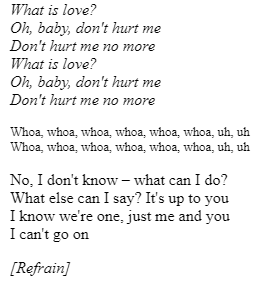
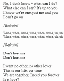

# Evenement - Interactions

Après avoir été rappelé à l'ordre, la créatrice à correctement rempli la page et le css. Par contre, elle n'as pas réussi à mettre en place les evènements; elle ne sait pas faire de **js**. Ayant entendu parlé de vous, elle vous délègue cette tache, ayant même pris soin de permettre la modification de ses fichiers pour que ce soit plus facile.

**Remarque** : Il n'y a normalement pas besoin de modifier `index.html` et `style.css`, ils sont modifiables afin que vous puissiez ajouter des interactions et décorations supplémentaires.

## Travail à faire

1. Lorsque la boite **Masquer les paroles** est cochée, masquez tout les paroles et modifiez l'intitulé en **Afficher les paroles**  
2. Lorsque la boite **Masquer les refrains** est cochée, *remplacez* tous les refrains sauf le premier par **[Refrain]**, et modifiez l'intitulé de la boite en **Afficher les refrains**.  
3. Lorsque les refrains sont masqués. Le du survol de **[Refrain]** affiche le contenu du refrain :  
4. Avez vous réussi a ne pas laisser d'espaces blancs entre chaque paragraphe ?

## Conseils

- Si quand les cases sont cochées les éléments sont masquées avec succes, mais rappellez vous qu'il doit aussi être possible de les afficher à nouveau.
- Utilisez `element.addEventListener()` [Ref](https://developer.mozilla.org/fr/docs/Web/API/EventTarget/addEventListener) pour attacher une évènement à un element.
- Utilisez l'évènement click pour savoir quand la case est cochée.  Pour connaitre l'état de la case (cochée ou non), utiliser l'attribut `checked` [Ref](https://developer.mozilla.org/fr/docs/Web/HTML/Element/Input/checkbox#checked).
- Utilisez l'évènement `mouseenter` [Ref](https://developer.mozilla.org/fr/docs/Web/API/Element/mouseenter_event) pour savoir quand la souris survole l'element et `mouseleave` [Ref](https://developer.mozilla.org/fr/docs/Web/API/Element/mouseleave_event) pour savoir quand la souris ne le survole plus.
- Vous avez du mal à masquer les elements ? La classe `hidden` n'est pas là par hasard.
- Notez que **[Refrain]** est déjà présent dans `index.html`, peut être qu'il est possible de les *remplacer* seulement de manière visuelle (sans avoir a supprimer du texte).

**Amusez-vous bien pour la conception !** 🚀
