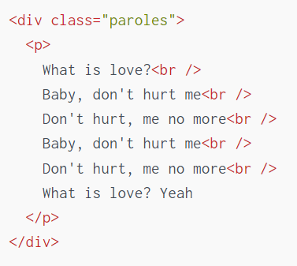

# Resumer

Grâce aux **exercices précédents**, vous avez pu voir

- La manipulation du DOM (selection, edition, suppression).
- La manipulation d'attribut/styles.
- La gestion des interactions (evenements). Cet exercice résume l'ensemble de ces techniques pour consolider votre maîtrise.
- Pour cet exercice, la Créatrice n'as pas pu être travailler à cause du confinement, les fichiers étant sur son ordinateur de travail. Elle vous à donc envoyé une chanson en format `json`, un fichier `index.html` **vide** (avec les scripts et styles importés), et un fichier `style.css`

## Travail à faire

1. Ajoutez le titre de facon à avoir `<h1><small>auteur -</small> Titre de la chanson</h1>`.
2. Créer une div avec la classe paroles. Ajoutez-y les couplets, englobés dans des paragraphes `p`. Chaque ligne doit être séparée par un `br` qui permet de passer à la ligne suivante. Le résultat doit ressembler à quelquechose comme:  
3. Ajoutez un `footer` avec un copyright **© Copyright 2023 - Codeloccol** en bas de la page.
4. Vous pouvez ajouter les interacteurs de l'exercice précédent.  Pensez par contre que vous ne pouvez sélectionner les éléments qu'une fois qu'ils ont été ajoutés à la page.

## Conseils

- Le but est de tout faire en js.
- Observez la structure de la donnée qui vous est fournie.
- N'hésitez pas a créer des fonctions et a structurer votre code pour simplifier la lecture de certaines opérations. Par exemple, une fonction qui permet de créer un couplet.
-References:
  - `firstElementChild` [Ref](https://developer.mozilla.org/fr/docs/Web/API/ParentNode/firstElementChild).
  - `document.getElementById("un_id")` [Ref](https://developer.mozilla.org/fr/docs/Web/API/Document/getElementById).
  - `document.getElementsByClassName("nom_classe")` [Ref](https://developer.mozilla.org/fr/docs/Web/API/Element/getElementsByClassName) ou `document.querySelectorAll(".nom_classe")` [Ref](https://developer.mozilla.org/fr/docs/Web/API/Document/querySelectorAll)
    **Attention, ces fonctions retournent un tableau.**
  - `parent.removeChild(enfant)` [Ref](https://developer.mozilla.org/fr/docs/Web/API/Node/removeChild) afin de supprimer un élément enfant d'un élément parent.
  - `parent.appendChild(enfant)` [Ref](https://developer.mozilla.org/fr/docs/Web/API/Node/appendChild) pour ajouter un element.
    **Attention, appendChild n'accepte que des Node.**
  - `document.createElement("div")` [Ref](https://developer.mozilla.org/fr/docs/Web/API/Document/createElement) pour créer un `Element` [Ref](https://developer.mozilla.org/fr/docs/Web/API/Element) (dans ce cas, un div)
  - `document.createTextNode("un texte")` [Ref](https://developer.mozilla.org/fr/docs/Web/API/Document/createTextNode) pour créer un noeud de type `Text` [Ref](https://developer.mozilla.org/fr/docs/Web/API/Text) contenant un **texte**.

**Amusez-vous bien pour la conception !** 🚀
